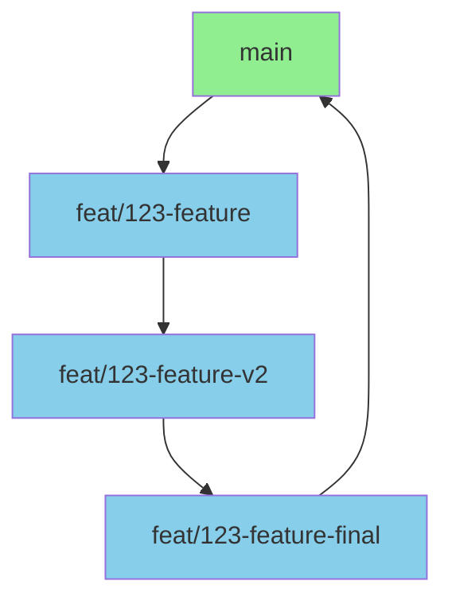

# Skill: Repository Maintainer

> **Version**: 2.0
> **Last Updated**: 2026-03-19
> **Purpose**: Establish a production-grade framework for managing the complete lifecycle of features from issue identification to pull request merge

---

## Table of Contents

1. [Core Principles](#core-principles)
2. [Workflow Pipeline](#workflow-pipeline)
3. [Tool Selection Matrix](#tool-selection-matrix)
4. [Issue Management Standards](#issue-management-standards)
5. [Branching Strategy](#branching-strategy)
6. [Code Review Protocol](#code-review-protocol)
7. [Pull Request Guidelines](#pull-request-guidelines)
8. [License & Attribution](#license--attribution)
9. [Error Handling & Fallbacks](#error-handling--fallbacks)
10. [Verification & Validation](#verification--validation)
11. [Best Practices Checklist](#best-practices-checklist)

---

## Core Principles

| Principle                 | Description                                                           | Anti-Pattern to Avoid                                            |
| :------------------------ | :------------------------------------------------------------------- | :-------------------------------------------------------------- |
| **Issue-First**           | Always start from a clearly defined issue; never work in vacuum     | Coding without clear requirements or acceptance criteria       |
| **Branch Per Task**       | Each feature/fix gets its own dedicated branch                      | Mixing multiple changes in single branch                       |
| **Atomic Commits**        | Commits should be small, focused, and self-contained                | Huge commits with multiple unrelated changes                   |
| **PR as Contract**        | Pull requests are contracts between past and future developers      | Incomplete PRs that break build or introduce technical debt    |
| **MIT License Integrity** | License file must remain intact and properly attributed              | Removing or modifying license without proper justification     |
| **Traceability**          | Every change must be traceable to an issue and PR                    | Changes without clear provenance                               |

---

## Workflow Pipeline

### Phase 1: Issue Selection

**Objective**: Identify and select the next priority task

#### Actions

1. **List open issues**
   - Use `github` MCP to query open issues
   - Sort by priority and age
   - Filter by label (bug, feature, enhancement, etc.)

2. **Issue selection criteria**
   - Verify issue is well-defined with clear acceptance criteria
   - Check for assigned contributors (avoid duplicate work)
   - Confirm no stale status or long inactivity
   - Validate no blocking dependencies exist

3. **Issue assignment**
   - Add self as assignee if not already assigned
   - Add relevant labels (in-progress, working)
   - Set estimated timeline if applicable

#### Output

- Selected issue with clear acceptance criteria
- Issue assigned to contributor
- Status updated to "in-progress"

### Phase 2: Branch Creation

**Objective**: Create dedicated branch for the selected task

#### Actions

1. **Update main branch**
   - Fetch latest changes from remote
   - Ensure local main is up to date
   - Verify clean working directory

2. **Create feature branch**
   - Use naming convention (see Branching Strategy)
   - Branch should be derived from current main
   - Verify branch creation locally and remotely

3. **Set up tracking**
   - Configure upstream tracking
   - Verify branch is visible in remote repository
   - Document branch name for reference

#### Output

- New branch created with proper naming
- Upstream tracking configured
- Branch documented for team reference

### Phase 3: Development

**Objective**: Implement the feature or fix with quality standards

#### Actions

1. **Code implementation**
   - Follow architectural standards
   - Write clear, maintainable code
   - Add appropriate tests
   - Update documentation as needed

2. **Format enforcement**
   - Apply 4-space indentation
   - Run Prettier before committing
   - Verify no linter warnings

3. **Commit discipline**
   - Commit frequently with clear messages
   - Follow Conventional Commits format
   - Reference issue number in commits

#### Output

- Feature/fix implemented
- Tests passing
- Code committed with clear messages

### Phase 4: Code Review

**Objective**: Ensure code quality before merge

#### Actions

1. **Self-review**
   - Read through all changes
   - Verify against acceptance criteria
   - Check formatting and style
   - Run all tests locally

2. **Pull request creation**
   - Create PR from feature branch to main
   - Include clear description
   - Reference issue number
   - Add appropriate labels

3. **Review feedback**
   - Address all review comments
   - Make requested changes
   - Request re-review when complete

#### Output

- PR approved by reviewers
- All comments addressed
- Ready for merge

### Phase 5: Merge & Cleanup

**Objective**: Integrate changes and maintain repository health

#### Actions

1. **Merge preparation**
   - Verify all checks passing
   - Rebase if necessary to avoid merge commits
   - Confirm no merge conflicts

2. **Merge execution**
   - Merge via squash or rebase (per project policy)
   - Delete feature branch after merge
   - Close referenced issue

3. **Cleanup**
   - Update PROJECT_CONTEXT.md if architectural changes
   - Document release notes if applicable
   - Update deployment documentation

#### Output

- Changes integrated into main
- Feature branch removed
- Issue closed

---

## Tool Selection Matrix

| Task                              | Primary Tool       | Fallback                   | When to Use                                      | Notes                                       |
| :-------------------------------- | :----------------- | :------------------        | :---------------------------------------------- | :--------------------------------------       |
| List open issues                  | `github` MCP       | GitHub web UI              | Find issues to work on                           | Query by label, assignee, state              |
| Create feature branch             | `execute_command`  | GitHub web UI              | Branch creation                                  | `git checkout -b feat/issue-123`            |
| Push branch                       | `execute_command`  | GitHub web UI              | Push branch to remote                            | `git push -u origin feat/issue-123`         |
| Create pull request               | `github` MCP       | GitHub web UI              | Open PR with changes                             | Include title, description, labels           |
| Review code                       | `read_file` + `search_files` | GitHub web UI      | Examine PR changes                               | Use diff view on GitHub                      |
| Merge pull request                | `github` MCP       | GitHub web UI              | Merge approved PR                                | Verify checks passing first                  |
| Delete branch                     | `execute_command`  | GitHub web UI              | Cleanup after merge                              | `git branch -d feat/issue-123`              |
| Update LICENSE file               | `read_file` + `write_file` | `execute_command` | Add proper attribution                           | Verify MIT license format                    |
| Update PROJECT_CONTEXT.md         | `read_file` + `replace_in_file` | `execute_command` | Document architectural changes                  | Update after significant changes             |

---

## Issue Management Standards

### Issue Template Requirements

Every issue should include:

```markdown
# Issue: [Clear title]

## Description
[Detailed description of the problem or feature]

## Acceptance Criteria
- [ ] Criteria 1
- [ ] Criteria 2
- [ ] Criteria 3

## Additional Context
[Any relevant information, screenshots, links]

## Labels
- Type: [bug|feature|enhancement|documentation]
- Priority: [critical|high|medium|low]
- Status: [triage|in-progress|blocked]
```

### Issue Lifecycle

```
triage → in-progress → review → merged → closed
```

| Status       | Description                                   | Action Required                      |
| :----------- | :----------                                   | :---------                           |
| **triage**   | Issue identified, not yet assigned           | Assign contributor, set priority    |
| **in-progress** | Work started on issue                      | Regular updates, block if needed    |
| **review**   | Changes ready for review                    | Reviewer feedback, iterations       |
| **merged**   | Changes integrated into main                | Cleanup, documentation updates      |
| **closed**   | Issue fully resolved                        | None - completed                    |

### Priority Levels

| Priority  | Description                                  | Response Time   |
| :--------- | :----------                                  | :----------     |
| **critical** | Blocking production, security vulnerability | Immediate       |
| **high**     | Important for release, major functionality | 24 hours        |
| **medium**   | Important but not urgent                    | 48 hours        |
| **low**      | Nice to have, minor improvements            | 72 hours        |

---

## Branching Strategy

### Branch Naming Convention

| Branch Type | Pattern                    | Examples                        |
| :---------- | :----------                | :----------                     |
| **Feature** | `feat/{issue-number}-{description}` | `feat/123-user-auth`      |
| **Bugfix**  | `fix/{issue-number}-{description}`  | `fix/456-login-bug`       |
| **Hotfix**  | `hotfix/{issue-number}-{description}` | `hotfix/789-security-patch` |
| **Improvement** | `improvement/{description}`       | `improvement/error-handling` |
| **Documentation** | `docs/{description}`          | `docs/api-reference`      |

### Branch Lifecycle



### Branch Protection Rules

- [ ] PR must be reviewed before merge
- [ ] All CI checks must pass
- [ ] Branch must be up to date with main
- [ ] No direct pushes to main (enforced)
- [ ] Delete branch after merge

---

## Code Review Protocol

### Review Checklist

#### Code Quality

- [ ] **Indentation**: 4 spaces used consistently
- [ ] **Line length**: ≤80 characters
- [ ] **Prettier**: No formatting issues
- [ ] **Naming**: Clear, descriptive names
- [ ] **Function length**: <50 lines where reasonable

#### Architecture

- [ ] **Patterns**: Follows project architecture
- [ ] **Separation of concerns**: Clear module boundaries
- [ ] **Dependency management**: No circular dependencies
- [ ] **Error handling**: Appropriate try-catch blocks

#### Testing

- [ ] **Unit tests**: Added for new functionality
- [ ] **Test coverage**: >80% for new code
- [ ] **Edge cases**: Handled appropriately
- [ ] **Tests passing**: All tests pass locally

#### Documentation

- [ ] **JSDoc/TSDoc**: Public functions documented
- [ ] **README updates**: New features documented
- [ ] **Comments**: Explain why, not what
- [ ] **TODOs**: Properly formatted with issue references

### Review Response Time

| Status          | Expected Response Time | Escalation if No Response    |
| :-------------- | :--------------        | :----------                  |
| **Pending**     | 24 hours               | Ping reviewer                |
| **Waiting for changes** | 48 hours        | Ping author                  |
| **Stale**       | 7 days                 | Close/Archive PR             |

---

## Pull Request Guidelines

### PR Template

```markdown
# PR: [Clear title]

## Summary
[Brief summary of changes]

## Related Issue
Closes #123

## Changes
- Change 1
- Change 2
- Change 3

## Testing
- [ ] Unit tests added/updated
- [ ] Manual testing completed
- [ ] All tests passing

## Screenshots (if applicable)
[Add relevant screenshots]

## Review Notes
[Any special considerations for reviewers]
```

### PR Size Limits

| Metric              | Maximum       | Recommendation            |
| :------------------ | :-----------  | :----------               |
| **Lines changed**   | 500           | <200 ideal                |
| **Files changed**   | 10            | <5 ideal                  |
| **Commits**         | 15            | <5 ideal (squash)         |
| **Complexity**      | Low/Medium    | High requires more review |

### Merge Requirements

- [ ] All CI checks passing
- [ ] At least 1 approved review (2 for critical changes)
- [ ] All review comments addressed
- [ ] Branch up to date with base
- [ ] Tests passing
- [ ] Documentation complete

---

## License & Attribution

### MIT License Requirements

The MIT License template must be included in every repository:

```markdown
MIT License

Copyright (c) 2026 [Author Name]

Permission is hereby granted, free of charge, to any person obtaining a copy
of this software and associated documentation files (the "Software"), to deal
in the Software without restriction, including without limitation the rights
to use, copy, modify, merge, publish, distribute, sublicense, and/or sell
copies of the Software, and to permit persons to whom the Software is
furnished to do so, subject to the following conditions:

The above copyright notice and this permission notice shall be included in all
copies or substantial portions of the Software.

THE SOFTWARE IS PROVIDED "AS IS", WITHOUT WARRANTY OF ANY KIND, EXPRESS OR
IMPLIED, INCLUDING BUT NOT LIMITED TO THE WARRANTIES OF MERCHANTABILITY,
FITNESS FOR A PARTICULAR PURPOSE AND NONINFRINGEMENT. IN NO EVENT SHALL THE
AUTHORS OR COPYRIGHT HOLDERS BE LIABLE FOR ANY CLAIM, DAMAGES OR OTHER
LIABILITY, WHETHER IN AN ACTION OF CONTRACT, TORT OR OTHERWISE, ARISING FROM,
OUT OF OR IN CONNECTION WITH THE SOFTWARE OR THE USE OR OTHER DEALINGS IN THE
SOFTWARE.
```

### Attribution Requirements

When adding new files or making significant contributions:

1. **License file remains intact** - Never modify or remove LICENSE
2. **Copyright notice preserved** - Keep original copyright statements
3. **Contribution attribution** - Add contributor to AUTHORS if applicable
4. **Dependency attribution** - Update third-party licenses file

### Attribution File Structure

```
LICENSE                  # Main license file (must exist)
AUTHORS                  # List of contributors
CONTRIBUTORS.md          # Detailed contribution history
THIRD_PARTY_LICENSES.md  # Third-party dependencies
```

---

## Error Handling & Fallbacks

### Common Error Scenarios

| Error Scenario            | Immediate Action                                   | Escalation Path                                                  |
| :------------------------ | :------------------------------------------------- | :--------------------------------------------------------------- |
| **Merge conflict**        | Pull latest main, resolve conflicts locally        | Request re-review after resolution                            |
| **CI failing**            | Investigate failure, fix locally, push update      | Escalate to team lead if persistent                           |
| **Branch not found**      | Verify branch exists, create if needed             | Check GitHub web UI to confirm state                          |
| **PR review blocked**     | Ping assignees, clarify blocking issues            | Escalate to team lead if unresolved after 48 hours            |
| **Issue not found**       | Verify issue exists and is accessible              | Check GitHub web UI or re-create issue                        |
| **License file missing**  | Restore from git history or add fresh template     | Document in PR why license needs addition                     |

### Retry Strategy

```zsh
# Pattern: Handle merge conflicts
git pull origin main
git checkout feat/123-feature
git merge main  # May need manual resolution
git push origin feat/123-feature

# Pattern: Verify PR status
# Check GitHub web UI if API returns unexpected result
```

### Logging Requirements

Every maintainer action should log:

```markdown
## Repository Maintenance Log

- **Timestamp**: YYYY-MM-DD HH:MM:SS
- **Action**: [issue/branch/PR/merge]
- **Entity**: [issue #123, branch feat/123-feature, etc.]
- **Status**: [created|modified|merged|closed]
- **User**: [actor]
- **Notes**: [any additional context]
```

---

## Verification & Validation

### Automated Checks

Run these after each major action:

#### Branch Creation Checklist

- [ ] Branch name follows naming convention
- [ ] Branch created from current main
- [ ] Upstream tracking configured
- [ ] Branch visible in remote repository

#### Pull Request Creation Checklist

- [ ] PR title follows Conventional Commits
- [ ] Issue referenced in PR description
- [ ] PR template completed
- [ ] Labels applied appropriately
- [ ] Assignees set correctly

#### Merge Checklist

- [ ] All CI checks passing
- [ ] Required approvals obtained
- [ ] Review comments resolved
- [ ] Branch up to date with base
- [ ] Tests passing locally and in CI

#### Post-Merge Checklist

- [ ] Feature branch deleted
- [ ] Issue closed and linked to PR
- [ ] PROJECT_CONTEXT.md updated if applicable
- [ ] Release notes updated

### Manual Verification

When uncertainty exists:

1. **Code review**: Does the code meet quality standards?
2. **Test execution**: Run all tests to verify changes
3. **Architecture review**: Does it align with documented standards?
4. **Integration testing**: Verify with dependent services

### Success Criteria

Repository maintenance is successful when:

- All changes traceable to an issue
- Feature branch deleted after merge
- Issue closed with proper reference
- LICENSE file intact
- No merge conflicts on main branch
- All CI checks passing

---

## Best Practices Checklist

### Pre-Issue Checklist

- [ ] Verify issue is well-defined
- [ ] Check for duplicate issues
- [ ] Review issue labels and priority
- [ ] Confirm no active work on issue

### Pre-Branch Checklist

- [ ] Main branch up to date
- [ ] Clean working directory
- [ ] Issue number documented
- [ ] Branch naming convention understood

### Pre-PR Checklist

- [ ] All tests passing
- [ ] Code formatted with Prettier
- [ ] JSDoc/TSDoc comments complete
- [ ] README updated if needed
- [ ] Self-review completed

### Pre-Merge Checklist

- [ ] All CI checks passing
- [ ] Required approvals obtained
- [ ] Review comments addressed
- [ ] Branch up to date
- [ ] Merge strategy confirmed

### Post-Merge Checklist

- [ ] Feature branch deleted
- [ ] Issue closed with reference
- [ ] PROJECT_CONTEXT.md updated
- [ ] Documentation reviewed
- [ ] Release notes updated

### Emergency Stop Checklist

If encountering unexpected issues:

- [ ] **Check logs**: What was the last successful operation?
- [ ] **Verify GitHub status**: Are there service outages?
- [ ] **Check network**: Can external sites be reached?
- [ ] **Report**: Document exactly what failed and when

---

## Quick Reference

### Common Git Commands

```zsh
# Create feature branch
git checkout -b feat/123-user-auth

# Push branch
git push -u origin feat/123-user-auth

# Update branch with main
git pull origin main

# Squash merge (when approved)
git pull origin main
git rebase -i HEAD~n
git push --force-with-lease

# Delete branch after merge
git branch -d feat/123-user-auth
git push origin --delete feat/123-user-auth
```

### Branch Naming Examples

| Type    | Pattern                          | Example                        |
| :----- | :-----                          | :-----                         |
| Feature | `feat/{issue}-{description}`    | `feat/123-user-auth`           |
| Bugfix  | `fix/{issue}-{description}`     | `fix/456-login-bug`            |
| Hotfix  | `hotfix/{issue}-{description}`  | `hotfix/789-security-patch`    |

### Issue Labels

| Label       | Purpose                                |
| :---------- | :----------                            |
| `bug`       | Identified bug                         |
| `feature`   | New feature request                    |
| `enhancement` | Improvement to existing feature      |
| `documentation` | Documentation updates               |
| `priority/critical` | Blocks production                 |
| `priority/high` | Important for next release         |
| `priority/medium` | Nice to have                     |
| `priority/low` | Trivial or cosmetic                |
| `status/in-progress` | Currently being worked on        |
| `status/needs-review` | Ready for review                 |

---

## Revision History

| Version | Date       | Changes                                                                 |
| :------ | :--------- | :---------------------------------------------------------------------- |
| 1.0     | Initial    | Minimal 4-point workflow outline                                       |
| 2.0     | 2026-03-19 | Complete rewrite: added principles, workflow pipeline, tool matrix, issue management standards, branching strategy, code review protocol, pull request guidelines, license requirements, error handling, verification, and best practices |

---

**End of Repository Maintainer Skill**