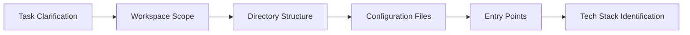

# Discovery Protocol

> **Version**: 2.0
> **Last Updated**: 2026-03-19
> **Purpose**: Establish a systematic, production-grade approach to understanding codebases before any implementation

---

## Table of Contents

1. [Core Principles](#core-principles)
2. [Discovery Workflow](#discovery-workflow)
3. [MCP Server Usage Matrix](#mcp-server-usage-matrix)
4. [Verification & Validation](#verification--validation)
5. [Error Handling & Fallbacks](#error-handling--fallbacks)
6. [Discovery Checklist](#discovery-checklist)

---

## Core Principles

| Principle             | Description                                                                    | Anti-Pattern to Avoid                                                      |
| :-------------------- | :----------------------------------------------------------------------------- | :------------------------------------------------------------------------- |
| **filesystem-first**  | Exhaust local file system before reaching for external tools                   | Jumping to web searches or MCP tools without understanding local structure |
| **progressive depth** | Start with high-level overviews; drill down only when needed                   | Spending hours on irrelevant files before grasping the architecture        |
| **hypothesis-driven** | Form explicit questions; use discovery to test/eliminate hypotheses            | Random exploration without clear objectives                                |
| **cross-reference**   | Verify findings using multiple tools and sources                               | Relying solely on one tool or one source of information                    |
| **atomic evidence**   | Document each finding with specific file paths, line numbers, or code snippets | Vague statements like "the code uses React" without specifics              |

---

## Discovery Workflow

### Phase 1: Scoping & Context

**Objective**: Establish project boundaries and high-level architecture



**Actions**:

1. Parse task requirements and extract key terms
2. List top-level directories using `filesystem/list_directory`
3. Read `package.json`, `pyproject.toml`, `Cargo.toml`, or equivalent
4. Identify primary entry points (e.g., `main.ts`, `app.py`, `main.rs`)
5. Document tech stack from dependencies/config

**Output**: One-paragraph project summary including:

- Project type and purpose
- Primary technology stack
- Directory organization pattern
- Key entry points and their responsibilities

---

### Phase 2: Structural Analysis

**Objective**: Map the architecture and understand component relationships

**Actions**:

1. Use `search_files` with patterns like `import|from|include|require` to trace dependencies
2. List code definition names using `list_code_definition_names` for each relevant directory
3. Identify patterns: service layers, domain models, API routes
4. Map circular dependencies or tight coupling warnings
5. Note test file locations and patterns

**Output**: Architecture diagram in markdown (text-based) showing:

- Layered architecture (presentation, domain, data)
- Service boundaries
- Key abstractions and their implementations

---

### Phase 3: Deep Dive

**Objective**: Understand specific implementation details required for the task

**Actions**:

1. Read key files in target directories
2. Search for TODO comments, FIXME markers, and documented issues
3. Check version control history (`git log`) for recent changes to relevant files
4. Identify deprecation warnings or migration needs

**Output**: Detailed implementation notes including:

- Current behavior of target components
- Relevant configuration and environment variables
- Known limitations or technical debt
- Related tests or integration points

---

### Phase 4: External Context (When Needed)

**Objective**: Verify library versions, best practices, and API behavior

**Gate Check**: Only proceed if:

- Local documentation is insufficient
- Version is unclear from package lock files
- API behavior is ambiguous from code inspection

**Actions**:

1. Use `context7` for Upstash documentation queries
2. Use `crawl4ai` for official documentation fetching
3. Use `brave-search` for community best practices and recent changes
4. Cross-reference with GitHub repository if available

**Output**: External context report with:

- Verified library versions
- Link to official documentation used
- Any version-specific caveats or breaking changes noted

---

## MCP Server Usage Matrix

| Task                    | Primary Tool                | Fallback                      | When to Use                                     |
| :---------------------- | :-------------------------- | :---------------------------- | :---------------------------------------------- |
| List directory contents | `filesystem/list_directory` | `execute_command` with `ls`   | Initial exploration                             |
| Read file contents      | `filesystem/read_file`      | `execute_command` with `cat`  | Code, config, docs                              |
| Search files by pattern | `filesystem/search_files`   | `execute_command` with `grep` | Finding code patterns                           |
| Search the web          | `brave-search`              | `crawl4ai`                    | Finding external documentation, tutorials       |
| Crawl web pages         | `crawl4ai`                  | `brave-search`                | Fetching official documentation, API references |
| Browser automation      | `playwright`                | N/A                           | Testing UI, scraping dynamic content            |
| Devcontainer info       | `devcontainer`              | N/A                           | Understanding containerized environments        |
| Documentation queries   | `context7`                  | `crawl4ai`                    | Upstash documentation search                    |
| GitHub operations       | `github`                    | `execute_command` with `gh`   | Issues, PRs, repository info                    |

---

## Verification & Validation

### Code Verification Checklist

- [ ] **File exists**: Confirmed via `filesystem/list_directory` or `filesystem/read_file`
- [ ] **Content matches expectation**: Code snippet read and analyzed
- [ ] **Version is current**: Dependency versions verified against lock file or config
- [ ] **No conflicting patterns**: Search for contradictory implementations in related files
- [ ] **Tests exist**: Related tests found or identified as missing

### Documentation Verification Checklist

- [ ] **Official source**: Documentation fetched from official repository or domain
- [ ] **Version match**: Documentation version matches project's dependency
- [ ] **Date check**: Documentation is recent enough for current API surface
- [ ] **Cross-reference**: At least two sources confirm the same behavior

---

## Error Handling & Fallbacks

| Error Scenario            | Immediate Action                                   | Escalation Path                                                  |
| :------------------------ | :------------------------------------------------- | :--------------------------------------------------------------- |
| MCP server unavailable    | Check `mcp.json` configuration                     | Verify `npx` is installed, retry after brief delay               |
| File not found            | Verify path via `list_directory`                   | Search for alternative naming (e.g., `Main.java` vs `main.java`) |
| Search returns no results | Relax regex pattern, broaden search scope          | Ask user to clarify requirements                                 |
| Documentation timeout     | Try alternative source, check network connectivity | Use `execute_command` with `curl` to verify connectivity         |
| Version ambiguity         | Check all version sources, note discrepancy range  | Flag as technical debt for later resolution                      |

---

## Discovery Checklist

Use this checklist at the end of every discovery session before proceeding to implementation:

### Phase 1 Checklist: Scoping

- [ ] Project type and purpose identified
- [ ] Technology stack documented with version numbers
- [ ] Directory structure mapped (top 3 levels)
- [ ] Entry points identified
- [ ] Configuration files located and read

### Phase 2 Checklist: Structure

- [ ] Architecture layers identified
- [ ] Key abstractions and their implementations mapped
- [ ] Dependency graph sketched
- [ ] Test file locations identified
- [ ] Circular dependencies or tight coupling flagged

### Phase 3 Checklist: Deep Dive

- [ ] Target files read and understood
- [ ] TODOs/FIXMEs documented
- [ ] Recent changes checked via git
- [ ] Configuration dependencies identified
- [ ] Related tests found or noted as missing

### Phase 4 Checklist: External Context (if applicable)

- [ ] Library versions verified
- [ ] Official documentation sources cited
- [ ] Version-specific caveats noted
- [ ] Cross-referenced with at least one additional source

---

## Integration with Other Rules

| Related Rule                        | Discovery Implication                                                         |
| :---------------------------------- | :---------------------------------------------------------------------------- |
| **00-claude-4-sonnet-emulation.md** | Strict XML format required in tool calls; Plan/Act mode awareness             |
| **02-code-quality.md**              | Discovery must identify formatting violations; Prettier compatibility checked |
| **03-environment-safety.md**        | Verify environment setup before execution; check for required CLI tools       |
| **04-secret-hygiene.md**            | Scan for hardcoded secrets, `.env` patterns, API key exposure                 |
| **05-agent-collaboration.md**       | Document findings for handoff; use consistent terminology                     |

---

## Discovery Artifacts Template

Save discovery outputs using this template:

```markdown
# Discovery: [Feature/Module Name]

## Summary

[1-paragraph overview of the codebase/component]

## Tech Stack

- **Language**: [language]
- **Framework**: [framework] @ [version]
- **Build Tool**: [tool] @ [version]

## Architecture
```

[Layer 1]
└── [Component A] -> [Component B]
[Layer 2]
└── [Component C] -> [Component B]

```

## Entry Points
| File | Purpose |
| :--- | :------ |
| `src/main.ts` | Application entry point |
| `src/server.ts` | HTTP server initialization |

## Key Dependencies
| Package | Version | Purpose |
| :------ | :------ | :------ |
| express | ^4.18.0 | Web framework |
| mongoose | ^8.0.0 | MongoDB ODM |

## Verified Questions
- [x] How authentication is implemented
- [x] Database connection pattern
- [ ] API endpoint structure (still under investigation)

## Open Questions
1. [Question text] - [Research plan]
2. [Question text] - [Research plan]
```

---

## Revision History

| Version | Date       | Changes                                                                                                                |
| :------ | :--------- | :--------------------------------------------------------------------------------------------------------------------- |
| 1.0     | Initial    | Minimal 3-point protocol                                                                                               |
| 2.0     | 2026-03-19 | Complete rewrite: added workflow diagrams, MCP matrix, verification checklists, error handling, and artifact templates |

---

**End of Discovery Protocol**
