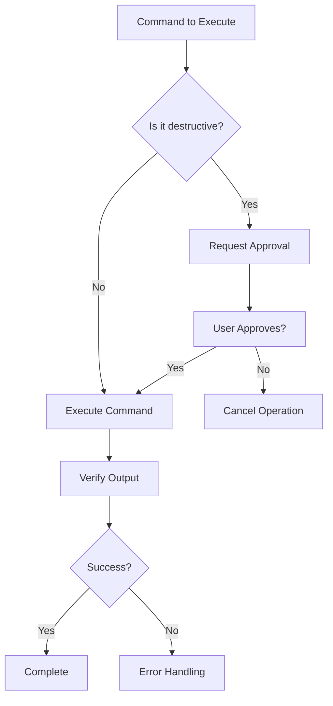

# Environment & Shell Safety

> **Version**: 2.0
> **Last Updated**: 2026-03-19
> **Purpose**: Establish safe, reliable command execution in the ezrepo development environment

---

## Table of Contents

1. [Core Principles](#core-principles)
2. [Shell Compatibility](#shell-compatibility)
3. [Container Environment Guidelines](#container-environment-guidelines)
4. [Docker-in-Docker Operations](#docker-in-docker-operations)
5. [Command Execution Safety](#command-execution-safety)
6. [Command Categories & Approval Requirements](#command-categories--approval-requirements)
7. [Error Handling & Recovery](#error-handling--recovery)
8. [Verification & Validation](#verification--validation)
9. [Safety Checklist](#safety-checklist)

---

## Core Principles

| Principle             | Description                                                                     | Anti-Pattern to Avoid                                          |
| :-------------------- | :------------------------------------------------------------------------------ | :------------------------------------------------------------- |
| **Safety-first**      | Default to non-destructive operations; require approval for destructive actions | Running commands that delete/modify files without confirmation |
| **Container-aware**   | Commands must work within Ubuntu 24.04 container constraints                    | Assuming access to host-level features or GUI applications     |
| **Shell-agnostic**    | Commands must be compatible with Zsh and Oh My Zsh                              | Using Bash-specific features that break in Zsh                 |
| **Multi-arch aware**  | Commands must work across x86_64, ARM64, and other architectures                | Architecture-specific assumptions in build commands            |
| **Verify-first**      | Always verify command output before proceeding                                  | Assuming success without checking exit codes or output         |
| **Minimal-privilege** | Use `sudo` only when absolutely necessary; prefer user-space operations         | Running everything as root or with elevated privileges         |

---

## Shell Compatibility

### Zsh Requirements

All commands must be compatible with **Zsh** (default shell) and **Oh My Zsh** plugins.

#### Zsh-Specific Considerations

| Feature               | Zsh Behavior                   | Workaround for Bash Compatibility     |
| :-------------------- | :----------------------------- | :------------------------------------ |
| **Default shell**     | `/usr/bin/zsh`                 | Use `#!/bin/zsh` in scripts           |
| **Glob qualifiers**   | Supports `(q)` syntax          | Avoid or use standard globbing        |
| **History expansion** | Enabled by default             | Use `setopt NO_HIST_APPEND` if needed |
| **Prompt expansion**  | `%` sequences expanded         | Escape with `\%` in scripts           |
| **Aliases**           | Expanded in scripts by default | Use `setopt NO_ALIASES` in scripts    |

#### Recommended Zsh Features

```zsh
# Oh My Zsh plugins recommended for clarity and safety
plugins=(
  git          # Git aliases and functions
  docker       # Docker completion and aliases
  sudo         # Quick sudo via esc
  history      # Extended history features
  zsh-syntax-highlighting  # Visual feedback for commands
)
```

#### Common Shell Compatibility Issues

```zsh
# ✗ Avoid (Bash-specific)
[[ condition ]] && echo "true"

# ✓ Use (Zsh-compatible)
[[ condition ]] && echo "true"
# or for maximum compatibility
test condition && echo "true"
```

```zsh
# ✗ Avoid (Bash-only arrays)
arr=(item1 item2)

# ✓ Use (Zsh and Bash compatible)
set -A arr item1 item2
# or simply
arr=(item1 item2)  # Works in both modern shells
```

---

## Container Environment Guidelines

### Ubuntu 24.04 Environment

This is a **multi-arch Ubuntu 24.04 container**. Key constraints:

| Constraint                  | Impact on Command Execution                                   | Example                                                   |
| :-------------------------- | :------------------------------------------------------------ | :-------------------------------------------------------- |
| **No host GUI**             | Cannot use GUI applications (xdg-open, GUI text editors)      | Use `code` for VS Code, `vim`/`nano` for terminal editors |
| **Container filesystem**    | Changes to `/` may not persist; use `/home/alx` for work      | Never modify `/usr/bin` without cause                     |
| **Limited system services** | systemd, cron may not be available                            | Use `cron` from cronie package if needed                  |
| **No host network**         | Network isolation applies; use Docker networks for containers | `--network=host` only when necessary                      |

### Common Container Limitations

| Feature                   | Availability in Container | Recommended Alternative                       |
| :------------------------ | :------------------------ | :-------------------------------------------- |
| **GUI applications**      | ❌ Not available          | Terminal-based editors: `vim`, `nano`, `code` |
| **Systemd**               | ❌ Not available          | Direct service commands or cron               |
| **Host kernel modules**   | ❌ Not available          | Use container-appropriate solutions           |
| **Hardware acceleration** | ⚠️ Limited                | Use software fallbacks                        |
| **Docker daemon**         | ✅ Available (DinD)       | Use Docker CLI from container                 |

### Package Management

```zsh
# Update package lists (always run first in new sessions)
apt-get update

# Install packages (prefer non-interactive)
apt-get install -y --no-install-recommends <package>

# Clean up after installation
apt-get clean && rm -rf /var/lib/apt/lists/*
```

---

## Docker-in-Docker Operations

### Docker Usage from Container

The environment supports **Docker-in-Docker (DinD)** operations. Use the provided Docker features.

### Docker Command Guidelines

#### Safe Docker Commands (Non-approval Required)

```zsh
# Listing containers and images
docker ps
docker ps -a
docker images

# Inspecting resources
docker inspect <container_or_image>
docker logs <container>
docker stats

# Non-destructive operations
docker volume ls
docker network ls
```

#### Commands Requiring Approval (Destructive)

| Command Type             | Approval Required | Rationale                            |
| :----------------------- | :---------------- | :----------------------------------- |
| **Container removal**    | ✅ Yes            | `docker rm -f` destroys data         |
| **Image removal**        | ✅ Yes            | `docker rmi` affects shared images   |
| **System prune**         | ✅ Yes            | `docker system prune` is destructive |
| **Container start/stop** | ⚠️ Consider       | May affect running services          |
| **Network creation**     | ⚠️ Consider       | May conflict with existing setup     |

#### Docker Command Examples

```zsh
# ✓ Safe: List running containers
docker ps --format "table {{.Names}}\t{{.Image}}\t{{.Status}}"

# ✓ Safe: View container logs
docker logs myapp --tail 50

# ✗ Requires approval: Remove container
docker rm -f myapp

# ✗ Requires approval: Remove image
docker rmi ubuntu:20.04

# ⚠️ Consider approval: Stop container
docker stop myapp
```

### Docker Compose Operations

```zsh
# Safe: View compose status
docker-compose ps

# Safe: View compose logs
docker-compose logs -f

# ⚠️ Consider approval: Stop services
docker-compose down

# ✗ Requires approval: Remove volumes
docker-compose down -v
```

---

## Command Execution Safety

### Pre-Execution Checklist

Before executing any command, verify:

1. **Command understanding**: Do I know what this command does?
2. **Target scope**: What files, containers, or services will be affected?
3. **Reversibility**: Can this operation be undone? If so, how?
4. **Dependencies**: Will this break existing functionality?

### Command Structure

All commands should follow this structure:

```zsh
# Format: [flags] [command] [args...]
# Flags first, then command, then arguments
<flags> <command> <arguments...>
```

#### Example: Safe apt installation

```zsh
# ✓ Good: Non-interactive, no suggested packages
apt-get install -y --no-install-recommends git

# ✗ Bad: Interactive, may prompt for user input
apt-get install git
```

#### Example: Safe directory listing

```zsh
# ✓ Good: Use long format with human-readable sizes
ls -lh /path/to/dir

# ✗ Bad: Output format varies by locale
ls /path/to/dir
```

---

## Command Categories & Approval Requirements

### Approval Matrix

| Category                  | Examples                                   | Approval Required | Verification Method         |
| :------------------------ | :----------------------------------------- | :---------------- | :-------------------------- |
| **Read-only**             | `ls`, `cat`, `grep`, `docker ps`           | ❌ No             | Output inspection           |
| **Informational**         | `docker inspect`, `df -h`, `free -m`       | ❌ No             | Output inspection           |
| **Non-destructive write** | `touch`, `echo`, `mkdir`                   | ❌ No             | File exists after operation |
| **Container lifecycle**   | `docker start`, `docker stop`              | ⚠️ Consider       | Container status check      |
| **Destructive read**      | `docker rm`, `rm -rf`, `docker rmi`        | ✅ Yes            | Verification required       |
| **System modification**   | `apt install`, `apt remove`, `apt upgrade` | ✅ Yes            | Package verification        |
| **Network change**        | `ufw enable`, firewall rules               | ✅ Yes            | Network connectivity test   |

### Approval Flow



### Safe Command Patterns

```zsh
# 1. Dry-run equivalent when available
docker-compose config  # Validate compose file without running

# 2. Use --dry-run or -n flags
apt-get install -s <package>  # Simulate installation

# 3. Verify before modify
[ -f /path/to/file ] && cp /path/to/file /path/to/file.bak

# 4. Use -y flag for non-interactive
apt-get install -y <package>
```

---

## Error Handling & Recovery

### Error Detection

Always check command exit codes:

```zsh
# Pattern: Check exit code
command && echo "Success" || echo "Failed with code $?"

# Pattern: Trap errors
if ! command; then
  echo "Command failed: $?"
  exit 1
fi

# Pattern: Error on pipeline failure
set -o pipefail
command1 | command2 | command3
```

### Common Error Scenarios

| Scenario                | Error Code | Recovery Strategy                           |
| :---------------------- | :--------- | :------------------------------------------ |
| **Command not found**   | 127        | Check PATH, install package, verify command |
| **Permission denied**   | 126, 1     | Use sudo, check file permissions            |
| **Container not found** | 1          | Verify container name, check docker ps      |
| **Image not found**     | 1          | Pull image first, verify docker images      |
| **Network error**       | 7, 56      | Check connectivity, retry                   |

### Recovery Patterns

```zsh
# Pattern: Retry with backoff
retry_count=0
max_retries=3
until [ $retry_count -ge $max_retries ]; do
  command && break
  retry_count=$((retry_count + 1))
  sleep $((retry_count * 2))
done

# Pattern: Cleanup on failure
cleanup() {
  [ -n "$TEMP_DIR" ] && rm -rf "$TEMP_DIR"
}
trap cleanup EXIT
```

---

## Verification & Validation

### Post-Execution Verification

After executing any command, verify:

1. **Exit status**: `echo $?` (0 = success)
2. **Expected output**: Does output match expectations?
3. **Side effects**: What files, containers, or services changed?

### Verification Checklist

For any operation, verify:

```zsh
# 1. Exit status
echo "Exit code: $?"

# 2. File operations
ls -lh /path/to/created/file

# 3. Container operations
docker ps -a --filter "name=<container_name>"

# 4. Package operations
dpkg -l | grep <package_name>
```

### Logging & Documentation

Document all significant operations:

```zsh
# Log format: [timestamp] [command] [result]
echo "$(date '+%Y-%m-%d %H:%M:%S') [docker ps] Success - 3 containers running" >> ~/operation.log
```

---

## Safety Checklist

### Pre-Command Checklist

Before executing any command:

- [ ] **Command understood**: Do I know exactly what this command does?
- [ ] **Arguments verified**: Are all arguments correct and properly quoted?
- [ ] **Dangerous flags identified**: Are flags like `-rf`, `-f`, `--force` present?
- [ ] **Target scope assessed**: What will be affected?
- [ ] **Rollback plan**: Can I undo this? How?
- [ ] **Exit status check**: How will I verify success?

### Post-Command Checklist

After executing any command:

- [ ] **Exit code checked**: Was `0` the exit code?
- [ ] **Output verified**: Does output match expectations?
- [ ] **Side effects confirmed**: What changed?
- [ ] **Error handling**: Were errors logged or handled?

---

## Quick Reference

### Common Safe Commands

```zsh
# System information
uname -a
cat /etc/os-release
df -h
free -m

# Docker status
docker info
docker ps
docker images

# File operations
ls -lh
find . -name "*.txt" -type f
grep -r "pattern" . --include="*.ts"
```

### Common Approved Commands (Docker)

```zsh
# Safe: Informational only
docker ps -a
docker images
docker inspect <container>
docker logs <container>
docker volume ls
docker network ls
```

### Common Commands Requiring Approval

```zsh
# Requires approval: Destructive
docker rm -f <container>
docker rmi <image>
rm -rf <path>
apt-get remove <package>
```

---

## Revision History

| Version | Date       | Changes                                                                                                                   |
| :------ | :--------- | :------------------------------------------------------------------------------------------------------------------------ |
| 1.0     | Initial    | Basic Zsh and Docker notes                                                                                                |
| 2.0     | 2026-03-19 | Complete rewrite: added workflow diagrams, approval matrix, verification checklists, error handling, and safety protocols |

---

**End of Environment & Shell Safety**
