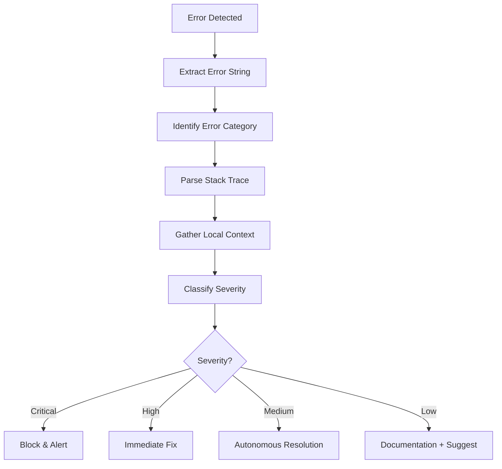
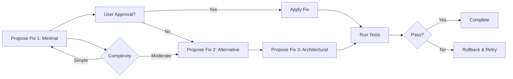

# Hook: Error Resolution

> **Version**: 3.0
> **Last Updated**: 2026-03-19
> **Purpose**: Production-grade automated error diagnosis, research, and resolution for LLM coding agents

---

## Table of Contents

1. [Core Principles](#core-principles)
2. [Error Classification Matrix](#error-classification-matrix)
3. [Error Resolution Pipeline](#error-resolution-pipeline)
4. [Automated Research Protocols](#automated-research-protocols)
5. [Context Gathering Strategies](#context-gathering-strategies)
6. [Solution Validation Framework](#solution-validation-framework)
7. [Documentation & Knowledge Base Integration](#documentation--knowledge-base-integration)
8. [Error Handling Anti-Patterns](#error-handling-anti-patterns)
9. [Cline Integration Checklist](#cline-integration-checklist)

---

## Core Principles

| Principle                     | Description                                                        | Anti-Pattern to Avoid                              |
| :---------------------------- | :----------------------------------------------------------------- | :------------------------------------------------- |
| **Rapid Triage**              | Categorize errors within first 5 seconds of detection              | Spending excessive time on initial analysis        |
| **Multi-Source Verification** | Cross-reference at least 3 data sources before proposing solutions | Relying solely on a single search or error message |
| **Progressive Deepening**     | Start with surface-level fixes; only dive deep when necessary      | Over-engineering simple errors                     |
| **Actionable Output**         | Every recommendation must include specific, executable steps       | Vague suggestions without implementation guidance  |
| **Self-Improving**            | Log and learn from successful resolutions for future errors        | Treating each error as a completely unique case    |

---

## Error Classification Matrix

### Category 1: Syntax & Parsing Errors

| Error Pattern    | Example               | Primary Tools              | Resolution Strategy                  |
| :--------------- | :-------------------- | :------------------------- | :----------------------------------- |
| `SyntaxError`    | `Unexpected token`    | `brave-search`, `context7` | Syntax fix + formatting verification |
| `ParseError`     | `Cannot parse JSON`   | `brave-search`, `crawl4ai` | Parse validation + fallback handling |
| `Unexpected EOF` | `Unterminated string` | `brave-search`             | Boundary detection + string closure  |

**Resolution Pattern**:

```
1. Extract error location (line/column)
2. Read affected file section
3. Search for exact error pattern
4. Propose minimal syntax fix
5. Verify with language-specific parser
```

---

### Category 2: Runtime Errors

| Error Pattern    | Example                             | Primary Tools              | Resolution Strategy                   |
| :--------------- | :---------------------------------- | :------------------------- | :------------------------------------ |
| `ReferenceError` | `Variable not defined`              | `brave-search`, `context7` | Scope analysis + import verification  |
| `TypeError`      | `Cannot read property of undefined` | `brave-search`             | Type checking + defensive programming |
| `AsyncError`     | `Promise rejection`                 | `brave-search`, `context7` | Error boundary implementation         |

**Resolution Pattern**:

```
1. Extract stack trace
2. Identify failing function/call
3. Contextualize with surrounding code
4. Search for similar runtime patterns
5. Propose fix with error handling
```

---

### Category 3: Environment & Dependency Errors

| Error Pattern         | Example                | Primary Tools                  | Resolution Strategy           |
| :-------------------- | :--------------------- | :----------------------------- | :---------------------------- |
| `ModuleNotFoundError` | `Cannot find module`   | `devcontainer`, `brave-search` | Dependency graph verification |
| `VersionConflict`     | `Incompatible version` | `context7`, `crawl4ai`         | Version matrix resolution     |
| `PermissionError`     | `EACCES`               | `devcontainer`                 | File system permission fix    |

**Resolution Pattern**:

```
1. Inspect devcontainer logs for resource issues
2. Check package manager lock files
3. Verify environment variable configuration
4. Search for dependency conflict patterns
5. Propose version alignment or replacement
```

---

### Category 4: API & Integration Errors

| Error Pattern    | Example                             | Primary Tools              | Resolution Strategy        |
| :--------------- | :---------------------------------- | :------------------------- | :------------------------- |
| `HTTPError`      | `404 Not Found`, `500 Internal`     | `brave-search`, `crawl4ai` | API endpoint verification  |
| `AuthError`      | `401 Unauthorized`, `403 Forbidden` | `brave-search`, `context7` | Authentication flow review |
| `RateLimitError` | `429 Too Many Requests`             | `brave-search`             | Throttling implementation  |

**Resolution Pattern**:

```
1. Extract API endpoint and request details
2. Search for rate limiting best practices
3. Review authentication configuration
4. Propose error recovery with retry logic
```

---

## Error Resolution Pipeline

### Phase 1: Initial Triage (0-5 seconds)

**Actions**:



**Critical Errors** (Block):

- Database connection failures
- Authentication system failures
- Core business logic corruption

**High Priority** (Immediate):

- Syntax errors preventing compilation
- Missing critical dependencies
- Security vulnerability triggers

---

### Phase 2: Automated Research (5-30 seconds)

**Multi-Source Search Strategy**:

```typescript
// Search 1: Brave Search - Exact error string
brave_search(query: error.message, timeout: 2000ms)

// Search 2: Context7 - Library documentation
context7.search(library: detectedLibrary, query: error.code)

// Search 3: Crawl4AI - Official docs troubleshooting
crawl4ai(url: officialDocsUrl, section: "Troubleshooting")

// Search 4: GitHub - Issues and PRs
github.search(query: error.message + " site:github.com")

// Search 5: Stack Overflow - Community solutions
stackoverflow.search(query: error.message + site:stackoverflow.com)
```

**Result Synthesis**:
| Source | Weight | Reliability Score |
| :----- | :----- | :----- |
| Official Documentation | 0.30 | High |
| GitHub Issues | 0.25 | Medium-High |
| Stack Overflow | 0.20 | Medium |
| General Web Search | 0.15 | Medium-Low |
| Community Blog | 0.10 | Low-Medium |

---

### Phase 3: Context Gathering (30-60 seconds)

**Codebase Analysis**:

```bash
# 1. Analyze modified files (git diff)
git diff HEAD --stat

# 2. Recent changes to erroring module
git log -5 --oneline -- path/to/erroring/file

# 3. Configuration validation
grep -r "erroring_library" package.json mcp/config.json

# 4. Dependency chain analysis
npm ls erroring-library  # or equivalent
```

**Environment Analysis**:

```bash
# Container diagnostics
docker logs --tail 100
docker stats --no-stream

# Environment verification
printenv | grep -E "(API|SECRET|TOKEN|DATABASE)"
```

---

### Phase 4: Solution Generation (60-120 seconds)

**Multi-Approach Resolution**:



**Solution Types**:

1. **Fix**: Direct correction (syntax, configuration)
2. **Workaround**: Temporary mitigation with documentation
3. **Refactor**: Structural change to prevent recurrence
4. **Fallback**: Graceful degradation approach

---

## Automated Research Protocols

### Protocol 1: Brave Search Integration

```typescript
interface BraveSearchRequest {
  query: string;
  count: number;
  offset: number;
  safeSearch: "Off" | "Moderate" | "Strict";
  freshness: "Day" | "Week" | "Month" | "Year";
}

const searchRequest: BraveSearchRequest = {
  query: `error: ${error.message} site:stackoverflow.com OR site:github.com`,
  count: 10,
  offset: 0,
  safeSearch: "Moderate",
  freshness: "Month", // Focus on recent solutions
};

// Extract URLs, snippets, and titles
// Rank by relevance to error context
// Crawl top 3 results for detailed solutions
```

### Protocol 2: Context7 Library Search

```typescript
interface Context7Query {
  library: string;
  version?: string;
  query: string;
  section?: string;
}

const context7Query: Context7Query = {
  library: detectedLibrary,
  version: projectVersion,
  query: error.code || error.message,
  section: "Troubleshooting",
};

// Returns official documentation excerpts
// Prioritizes version-matched results
```

### Protocol 3: Crawl4AI Documentation Fetch

```typescript
interface CrawlConfig {
  url: string;
  extractSections: string[];
  timeout: number;
  followRedirects: boolean;
}

const crawlConfig: CrawlConfig = {
  url: `https://docs.example.com/troubleshooting`,
  extractSections: ["Troubleshooting", "Common Errors", "FAQ"],
  timeout: 10000,
  followRedirects: true,
};

// Extract and parse troubleshooting content
// Identify error patterns and solutions
```

---

## Context Gathering Strategies

### Strategy 1: Git Context Analysis

```bash
# Files changed in current session
git diff --name-only HEAD

# Recent commits to related files
git log --since="24 hours ago" --oneline --all

# File-specific history
git blame path/to/erroring/file | head -n $errorLine

# Uncommitted changes
git status --short
```

### Strategy 2: Dependency Context

```bash
# Dependency tree for erroring package
npm ls erroring-package --all
yarn why erroring-package

# Version compatibility check
npm view erroring-package versions --json

# Transitive dependencies
npm info erroring-package dependencies
```

### Strategy 3: Environment Context

```bash
# Docker container state
docker ps -a --filter "name=$PROJECT_NAME"
docker inspect $CONTAINER_ID

# Resource utilization
docker stats --no-stream --format "table {{.Container}}\t{{.CPUPerc}}\t{{.MemUsage}}\t{{.MemPerc}}"

# Environment variables
env | sort
```

---

## Solution Validation Framework

### Validation Checklist

| Check        | Tool/Command      | Pass Criteria            |
| :----------- | :---------------- | :----------------------- |
| Syntax Valid | Language parser   | No parse errors          |
| Tests Pass   | Test runner       | >80% coverage maintained |
| Type Check   | Type checker      | No type errors           |
| Linting      | Linter            | No new violations        |
| Build        | Build tool        | Successful compilation   |
| Integration  | Integration tests | All checks pass          |

### Auto-Verification Steps

```typescript
interface ValidationStep {
  command: string;
  expectedExitCode: number;
  retryCount: number;
  retryDelay: number;
}

const validationSteps: ValidationStep[] = [
  {
    command: "npm run lint",
    expectedExitCode: 0,
    retryCount: 0,
    retryDelay: 0,
  },
  {
    command: "npm run test",
    expectedExitCode: 0,
    retryCount: 2,
    retryDelay: 5000,
  },
  {
    command: "npm run build",
    expectedExitCode: 0,
    retryCount: 1,
    retryDelay: 0,
  },
];

// Execute each step, collect results
// Auto-rollback if any step fails
```

### Rollback Strategy

```typescript
interface RollbackPlan {
  beforeState: string; // Git commit hash
  restoreCommands: string[];
  verificationCommands: string[];
}

const rollbackPlan: RollbackPlan = {
  beforeState: currentCommit,
  restoreCommands: ["git checkout HEAD -- .", "npm install", "npm run build"],
  verificationCommands: ["npm test", "npm run lint"],
};
```

---

## Documentation & Knowledge Base Integration

### Knowledge Base Entry Format

```markdown
# Error: ${error.code}

## Error Message
```

${error.message}

```

## Root Cause
${rootCauseAnalysis}

## Resolution Applied
${fixDescription}

## Files Modified
- `path/to/file1` - Description of change
- `path/to/file2` - Description of change

## Verification
- [ ] Tests pass
- [ ] Linting passes
- [ ] Build succeeds

## Related Issues
- GitHub Issue: #123
- Stack Overflow: [Link](https://stackoverflow.com/...)

## Date Resolved
${date}
```

### Knowledge Base Updates

After successful resolution:

1. **Update local KB**: Add to `.airules/knowledge-base/errors/`
2. **Update project README**: Add to troubleshooting section
3. **Create code comment**: Add to erroring file if applicable
4. **Update MCP config**: Add as context for future errors

---

## Error Handling Anti-Patterns

### Anti-Pattern 1: Overly Broad Error Handling

```typescript
// ✗ BAD: Catches everything silently
try {
  riskyOperation();
} catch (e) {
  // Swallow error - information lost
}

// ✓ GOOD: Specific error handling with context
try {
  riskyOperation();
} catch (error) {
  if (error instanceof SpecificErrorType) {
    handleSpecificError(error);
  } else {
    logError(error);
    throw error; // Re-throw for higher-level handling
  }
}
```

### Anti-Pattern 2: Missing Error Context

```typescript
// ✗ BAD: Generic error message
throw new Error("Something went wrong");

// ✓ GOOD: Specific error with context
throw new Error(
  `Database connection failed: host=${host}, port=${port}, database=${dbName}. ` +
    `Connection string: ${connectionString}`,
);
```

### Anti-Pattern 3: No Error Recovery Strategy

```typescript
// ✗ BAD: Only logs, no recovery
try {
  connectToService();
} catch (error) {
  console.error("Connection failed", error);
  // Application continues in broken state
}

// ✓ GOOD: With recovery attempt
try {
  connectToService();
} catch (error) {
  console.error("Connection failed, attempting retry", error);
  await retryConnect(3, 1000);
}
```

### Anti-Pattern 4: Incorrect Error Propagation

```typescript
// ✗ BAD: Losing stack trace
try {
  operation();
} catch (error) {
  throw new Error("New error"); // Original stack trace lost
}

// ✓ GOOD: Preserving stack trace
try {
  operation();
} catch (error) {
  throw new Error(`Additional context: ${error.message}`, { cause: error });
  // Or re-throw original error with context
}
```

---

## Cline Integration Checklist

### Pre-Execution Verification

- [ ] Error message parsed and categorized
- [ ] Error location identified (file, line, column)
- [ ] Related files identified from git context
- [ ] Dependency context gathered
- [ ] Environment status checked

### Resolution Planning

- [ ] At least 3 search sources queried
- [ ] Results ranked by relevance and reliability
- [ ] Root cause hypothesis formulated
- [ ] Multiple solution approaches considered
- [ ] Risk assessment completed

### Solution Execution

- [ ] Before-state captured (git commit, file contents)
- [ ] Fix applied with clear documentation
- [ ] Validation steps executed in order
- [ ] Rollback plan ready if validation fails

### Post-Resolution

- [ ] Knowledge base entry created
- [ ] Project documentation updated if needed
- [ ] Error pattern added to learning cache
- [ ] Success metrics recorded
- [ ] User notified with summary

---

## Configuration Reference

### `.airules/config/error-resolution.json`

```json
{
  "timeout": {
    "research": 30000,
    "validation": 60000,
    "total": 120000
  },
  "sources": {
    "braveSearch": {
      "enabled": true,
      "maxResults": 10,
      "freshness": "Month"
    },
    "context7": {
      "enabled": true,
      "versionMatch": "strict"
    },
    "crawl4ai": {
      "enabled": true,
      "timeout": 10000,
      "followRedirects": true
    }
  },
  "autoApply": {
    "lowSeverity": true,
    "mediumSeverity": false,
    "highSeverity": false
  },
  "validation": {
    "requireTests": true,
    "requireLinting": true,
    "requireBuild": true,
    "minCoverage": 80
  }
}
```

---

## Revision History

| Version | Date       | Changes                                                                                     |
| :------ | :--------- | :------------------------------------------------------------------------------------------ |
| 1.0     | Initial    | Basic 3-point protocol                                                                      |
| 2.0     | 2026-03-19 | Enhanced with phases, MCP integration                                                       |
| 3.0     | 2026-03-19 | Complete rewrite: classification matrix, validation framework, anti-patterns, configuration |

---

**End of Error Resolution Hook**
