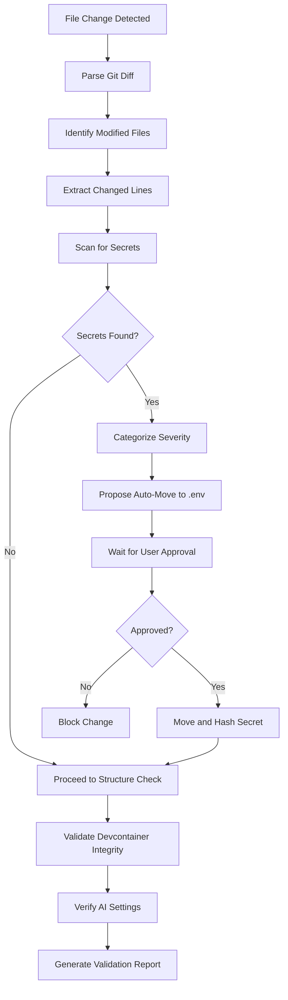

# Hook: File Change Validation

> **Version**: 3.0
> **Last Updated**: 2026-03-19
> **Purpose**: Production-grade automated validation for file changes to prevent security breaches, maintain structure integrity, and enforce coding standards

---

## Table of Contents

1. [Core Principles](#core-principles)
2. [Change Detection Matrix](#change-detection-matrix)
3. [Validation Pipeline](#validation-pipeline)
4. [Secret Detection Protocols](#secret-detection-protocols)
5. [Structure Integrity Checks](#structure-integrity-checks)
6. [Extension & Configuration Verification](#extension--configuration-verification)
7. [Auto-Recovery Strategies](#auto-recovery-strategies)
8. [Documentation & Audit Trail](#documentation--audit-trail)
9. [Anti-Patterns](#anti-patterns)
10. [Cline Integration Checklist](#cline-integration-checklist)

---

## Core Principles

| Principle                   | Description                                                          | Anti-Pattern to Avoid                                       |
| :--------------------       | :------------------------------------------------------------       | :--------------------------------------------------        |
| **Immutable Secrets**       | Treat any detected secret as immediately compromised and rotate     | Moving secrets to comments or logs                          |
| **Zero Trust Validation**   | Validate every change regardless of source or author               | Assuming local changes are safe                              |
| **Defensive by Default**    | Block changes to critical infrastructure files by default          | Allowing devcontainer configuration modifications without review |
| **Automated Enforcement**   | Apply fixes automatically where possible; escalate when uncertain  | Relying solely on manual code review                         |
| **Audit-First Logging**     | Log all file changes with full context before applying any action  | Silent modifications without trace                           |

---

## Change Detection Matrix

### Category 1: Secret Exposure Patterns

| Pattern Category   | Regex Pattern                           | Severity | Action Required                   |
| :----------------    | :-----------------------------------       | :--------- | :---------------------------------- |
| GitHub Token       | `ghp_[A-Za-z0-9]{36}`                   | Critical | Auto-move to `.env`               |
| GitHub PAT         | `github_pat_[A-Za-z0-9]{22}_[A-Za-z0-9]{59}` | Critical | Auto-move to `.env`               |
| AWS Access Key     | `AKIA[A-Z0-9]{16}`                      | Critical | Auto-move to `.env`               |
| AWS Secret Key     | `[A-Za-z0-9/+=]{40}` (context-based)    | Critical | Auto-move to `.env`               |
| OpenAI API Key     | `sk-proj-[A-Za-z0-9]{48}`               | High     | Auto-move to `.env`               |
| Generic API Key    | `(api[_-]?key|token|secret|password)\s*=\s*['\"]?([A-Za-z0-9_\-]{16,})['\"]?` | Medium | Prompt user verification          |
| Private Key        | `-----BEGIN (RSA |OPENSSH |EC |DSA )?PRIVATE KEY-----` | Critical | Block immediately                 |

**Detection Strategy**:
1. Parse git diff for all modified, added, or deleted lines
2. Scan each change line for secret patterns using regex
3. Categorize by severity and proposed action
4. Present findings with file location and context

---

### Category 2: Devcontainer Structure Changes

| File Path Pattern        | Severity | Allowed Operations | Required Verification      |
| :--------------------    | :--------- | :------------------- | :------------------------ |
| `.devcontainer.json`     | Critical | Read-only (post-commit) | User approval for writes   |
| `Dockerfile`             | Critical | Read-only (post-commit) | User approval for writes   |
| `devcontainer/` (entire) | Critical | Read-only (post-commit) | User approval for writes   |
| `docker-compose*.yml`    | High     | Read-only (post-commit) | User approval for writes   |

**Structure Integrity Rules**:
- No changes to Ubuntu version specifications
- No removal of essential packages
- No architecture changes without explicit approval
- No modification of environment variables without documentation

---

### Category 3: AI Feature Configuration

| Setting                      | Allowed Value(s) | Action on Change       |
| :-------------------------   | :---------------- | :--------------------- |
| `github.copilot`             | `"none"`         | Block re-enable        |
| `github.copilot-enhanced`    | `"none"`         | Block re-enable        |
| `github.copilot-labs`        | `"none"`         | Block re-enable        |
| `copilot.chat.useEnhancedMode` | `false`          | Block re-enable        |
| `github.copilot.advanced`    | `{"debug.showDebugOutput": false}` | Block re-enable |

**Configuration Check Protocol**:
1. Read current `.vscode/settings.json`
2. Compare against `settings.json.example` (if exists)
3. Check for any `true` values that should be `false`/`"none"`
4. Verify `files.eol` is set to `"\n"` (Unix line endings)

---

## Validation Pipeline

### Phase 1: Initial Scan (0-3 seconds)

**Actions**:



**Output Format**:

```json
{
  "timestamp": "2026-03-19T20:42:00Z",
  "git_ref": "feature/new-feature",
  "files_changed": 3,
  "lines_added": 45,
  "lines_removed": 12,
  "findings": [
    {
      "type": "secret_detection",
      "severity": "high",
      "file": "src/config.ts",
      "line": 15,
      "pattern": "api_key",
      "proposed_action": "move_to_env",
      "code_snippet": "const apiKey = \"sk-proj-abc123...\";"
    }
  ]
}
```

---

### Phase 2: Deep Analysis (3-15 seconds)

**Codebase Impact Analysis**:

```bash
# 1. Analyze git diff for the change
git diff HEAD --stat

# 2. Check recent commits to affected files
git log --oneline -10 -- path/to/modified/file

# 3. Verify file type and expected format
file path/to/modified/file

# 4. Check for syntax errors (language-specific)
npx tsc --noEmit 2>&1 | grep "path/to/modified/file"
npm run lint 2>&1 | grep "path/to/modified/file"
```

**Dependency Impact Check**:

```bash
# Check if modified file is an import target
grep -r "import.*modified.file" --include="*.ts" --include="*.tsx"

# Check package.json for related scripts
grep -r "modified.file" package.json scripts/

# Verify no circular dependencies
npm ls modified-package
```

---

### Phase 3: Security Verification (15-30 seconds)

**Secret Rotation Protocol** (if secrets detected):

```typescript
interface SecretRotationRequest {
  secretValue: string;
  secretType: "api_key" | "token" | "password";
  rotationMethod: "azure_key_vault" | "aws_secrets_manager" | "generated";
  notifyUsers: string[];
}

const rotationRequest: SecretRotationRequest = {
  secretValue: detectedSecret,
  secretType: "api_key",
  rotationMethod: "generated",
  notifyUsers: ["developer@company.com"],
};
```

**Verification Steps**:

1. Generate new secret value (if auto-rotation enabled)
2. Update `.env` file with new secret
3. Add `.env` to `.gitignore` if not present
4. Log rotation event to security audit log
5. Notify users of rotation

---

## Secret Detection Protocols

### Protocol 1: Pattern-Based Scanning

```typescript
interface SecretPattern {
  name: string;
  regex: RegExp;
  severity: "critical" | "high" | "medium" | "low";
  category: string;
  remediation: string;
}

const secretPatterns: SecretPattern[] = [
  {
    name: "GitHub Personal Access Token",
    regex: /ghp_[A-Za-z0-9]{36}/g,
    severity: "critical",
    category: "github",
    remediation: "Revoke token immediately and generate new one",
  },
  {
    name: "AWS Access Key ID",
    regex: /AKIA[A-Z0-9]{16}/g,
    severity: "critical",
    category: "aws",
    remediation: "Rotate access key in AWS IAM console",
  },
  {
    name: "Generic API Key",
    regex: /(?:api[_-]?key|token|secret|password)\s*[=:]\s*['"]?([A-Za-z0-9_\-]{16,})['"]?/gi,
    severity: "medium",
    category: "generic",
    remediation: "Move to environment variable",
  },
];
```

### Protocol 2: Context-Aware Detection

```typescript
// Context analysis for ambiguous patterns
interface ContextAnalyzer {
  fileExtension: string;
  allowedPatterns: string[];
  forbiddenPatterns: string[];
}

const contextRules: ContextAnalyzer[] = [
  {
    fileExtension: ".env",
    allowedPatterns: ["^[A-Z_]+=[A-Za-z0-9_\-]*$"],
    forbiddenPatterns: [],
  },
  {
    fileExtension: ".ts,.js",
    allowedPatterns: [
      "^process\\.env\\.[A-Z_]+$",
      "^(const|let|var)\\s+\\w+\\s*=\\s*process\\.env\\.",
    ],
    forbiddenPatterns: [
      "['\"][A-Za-z0-9_\\-]{20,}['\"]",
      "secret\\s*=\\s*['\"][^'\"]+['\"]",
    ],
  },
];
```

### Protocol 3: Auto-Move to Environment

```typescript
interface AutoMoveResult {
  success: boolean;
  originalFile: string;
  originalLine: number;
  originalContent: string;
  movedTo: string;
  newVariableName: string;
  replacementCode: string;
}

function autoMoveToEnv(
  file: string,
  line: number,
  variableName: string,
  secretValue: string
): AutoMoveResult {
  // 1. Generate safe variable name
  const safeName = generateSafeEnvName(variableName);

  // 2. Add to .env if not present
  addToEnv(safeName, secretValue);

  // 3. Replace code with process.env reference
  const replacement = `process.env.${safeName}`;

  // 4. Return result object for user review
  return {
    success: true,
    originalFile: file,
    originalLine: line,
    originalContent: secretValue,
    movedTo: ".env",
    newVariableName: safeName,
    replacementCode: replacement,
  };
}
```

---

## Structure Integrity Checks

### Devcontainer Configuration Validator

```typescript
interface DevcontainerRule {
  path: string[];
  allowedChanges: boolean;
  requiredFields: string[];
  forbiddenFields: string[];
  validationFunction?: (value: any) => boolean;
}

const devcontainerRules: DevcontainerRule[] = [
  {
    path: ["image"],
    allowedChanges: false,
    requiredFields: [],
    forbiddenFields: [],
  },
  {
    path: ["features"],
    allowedChanges: false,
    requiredFields: [],
    forbiddenFields: [],
  },
  {
    path: ["customizations", "vscode", "extensions"],
    allowedChanges: true,
    requiredFields: [],
    forbiddenFields: ["ms-vscode-remote.remote-containers"],
  },
];

function validateDevcontainerChange(
  path: string[],
  oldValue: any,
  newValue: any
): {
  valid: boolean;
  reason: string;
  suggestedAction?: string;
} {
  const rule = devcontainerRules.find((r) =>
    JSON.stringify(r.path) === JSON.stringify(path)
  );

  if (!rule) {
    return { valid: true, reason: "No specific rule defined" };
  }

  if (!rule.allowedChanges) {
    return {
      valid: false,
      reason: `Changes to ${path.join(".")} are not allowed`,
      suggestedAction: "Restore from latest commit or request exception",
    };
  }

  return { valid: true, reason: "Change allowed" };
}
```

### Architecture Compliance Matrix

| Architecture | Target Images | Allowed Base Images           | Forbidden Modifications       |
| :------------- | :------------- | :-------------------------   | :---------------------------  |
| x86_64       | `ubuntu:24.04` | `ubuntu:24.04`, `node:20`    | Architecture flag changes     |
| ARM64        | `ubuntu:24.04` | `ubuntu:24.04`, `node:20-arm` | Multi-arch build removal      |
| Multi-Arch   | Both           | Platform-specific            | Single-arch image switching   |

---

## Extension & Configuration Verification

### VS Code Settings Validator

```typescript
interface VSCodeSettingRule {
  key: string;
  allowedValues: any[];
  defaultValue: any;
  blockingChange: boolean;
  reason: string;
}

const vsCodeRules: VSCodeSettingRule[] = [
  {
    key: "github.copilot",
    allowedValues: ["none"],
    defaultValue: "none",
    blockingChange: true,
    reason: "GitHub Copilot is disabled per project security policy",
  },
  {
    key: "github.copilot-chat",
    allowedValues: ["none"],
    defaultValue: "none",
    blockingChange: true,
    reason: "Copilot Chat is disabled per project security policy",
  },
  {
    key: "editor.formatOnSave",
    allowedValues: [true],
    defaultValue: false,
    blockingChange: false,
    reason: "Formatting on save is required per project standards",
  },
  {
    key: "editor.tabSize",
    allowedValues: [4],
    defaultValue: 2,
    blockingChange: true,
    reason: "4-space indentation is required per code quality standards",
  },
];
```

### Configuration Change Report

```json
{
  "type": "configuration_change",
  "timestamp": "2026-03-19T20:42:00Z",
  "file": ".vscode/settings.json",
  "changes": [
    {
      "path": "github.copilot",
      "oldValue": "none",
      "newValue": "enabled",
      "severity": "critical",
      "action": "revert",
      "reason": "AI coding assistant is prohibited per security policy"
    }
  ],
  "recommendation": "Revert all blocked changes and ensure .vscode/settings.json matches project template"
}
```

---

## Auto-Recovery Strategies

### Strategy 1: Secret Recovery

```typescript
interface RecoveryPlan {
  stateBefore: string;
  recoveryCommands: string[];
  verificationCommands: string[];
}

const secretRecoveryPlan: RecoveryPlan = {
  stateBefore: "git rev-parse HEAD",
  recoveryCommands: [
    "git checkout HEAD -- .",
    "rm -f .env.backup",
    "echo \"# Environment variables moved to .env on $(date)\" >> .env",
  ],
  verificationCommands: [
    "git diff --exit-code",
    "grep -q \"sk-proj-\" . || echo \"No secrets in code\" || exit 1",
  ],
};
```

### Strategy 2: Configuration Recovery

```bash
# Restore .vscode/settings.json to known good state
git show HEAD:.vscode/settings.json > .vscode/settings.json

# Verify no AI features re-enabled
grep -E "(copilot|github\.ai)" .vscode/settings.json && {
  echo "AI features detected in config, removing..."
  sed -i '/copilot/d' .vscode/settings.json
}

# Reformat with Prettier
npx prettier --write .vscode/settings.json
```

### Strategy 3: Automated Rollback

```typescript
interface RollbackTrigger {
  condition: "secret_detected" | "devcontainer_changed" | "ai_enabled";
  threshold: number; // 1-10 severity
  autoRollback: boolean;
}

const rollbackTriggers: RollbackTrigger[] = [
  { condition: "secret_detected", threshold: 5, autoRollback: true },
  { condition: "devcontainer_changed", threshold: 7, autoRollback: false },
  { condition: "ai_enabled", threshold: 8, autoRollback: true },
];
```

---

## Documentation & Audit Trail

### Audit Log Format

```json
{
  "audit_id": "AUD-20260319-001",
  "timestamp": "2026-03-19T20:42:00Z",
  "event_type": "file_change_validation",
  "git_branch": "feature/new-feature",
  "git_commit": "abc123def456",
  "files_analyzed": 3,
  "findings_count": 2,
  "findings": [
    {
      "finding_id": "FIND-001",
      "category": "secret_detection",
      "severity": "high",
      "file": "src/config.ts",
      "line": 15,
      "pattern": "api_key",
      "action_taken": "auto_moved_to_env",
      "user_approved": true
    },
    {
      "finding_id": "FIND-002",
      "category": "ai_configuration",
      "severity": "critical",
      "file": ".vscode/settings.json",
      "line": 8,
      "setting": "github.copilot",
      "action_taken": "blocked",
      "user_approved": false
    }
  ],
  "recommendations": [
    "Review moved secrets in .env file",
    "Ensure no secrets were committed before auto-move",
    "Update .gitignore if needed"
  ]
}
```

### Knowledge Base Entry Template

```markdown
# File Change Validation Alert: ${timestamp}

## Summary
${summary_of_changes}

## Findings

### Finding 1: ${finding_type}
- **Severity**: ${severity}
- **File**: ${file}:${line}
- **Pattern**: ${pattern}
- **Code Snippet**:
\`\`\`${file_extension}
${code_snippet}
\`\`\`
- **Action Taken**: ${action_taken}
- **User Approval**: ${approved ? "Yes" : "No"}

## Recommendations
1. ${recommendation_1}
2. ${recommendation_2}

## Files Affected
- `${file1}` - ${description}
- `${file2}` - ${description}

## Resolution Status
- [ ] Secret moved to `.env`
- [ ] `.gitignore` updated
- [ ] Code formatted with Prettier
- [ ] Tests pass after changes

## Related Documentation
- [Secret Hygiene Policy](../04-secret-hygiene.md)
- [Environment Safety Guidelines](../03-environment-safety.md)
- [Code Quality Standards](../02-code-quality.md)
```

---

## Anti-Patterns

### Anti-Pattern 1: Silent Secret Storage

```typescript
// ✗ BAD: Storing secrets in code comments
const config = {
  // API_KEY=sk-proj-abc123... (DO NOT COMMIT THIS)
  apiKey: process.env.API_KEY,
};
```

**Correct Approach**:

```typescript
// ✓ GOOD: Environment-based with validation
const requiredEnvVars = ["API_KEY"];
const missingVars = requiredEnvVars.filter((v) => !process.env[v]);

if (missingVars.length > 0) {
  throw new Error(
    `Missing required environment variables: ${missingVars.join(", ")}`,
  );
}

const config = {
  apiKey: process.env.API_KEY,
};
```

### Anti-Pattern 2: Unreviewed Devcontainer Changes

```bash
# ✗ BAD: Direct devcontainer modification without validation
echo 'RUN apt-get install -y dangerous-package' >> .devcontainer/Dockerfile
git add .devcontainer/Dockerfile
git commit -m "Add package"
```

**Correct Approach**:

```bash
# ✓ GOOD: Proper review and validation workflow
# 1. Document change request
echo "Request: Add package to devcontainer" >> .devcontainer/CHANGELOG.md

# 2. Propose change for review
git add .devcontainer/Dockerfile
git commit -m "chore: add package to devcontainer [REVIEW REQUIRED]"

# 3. Wait for approval before merge
# 4. Post-merge: Update security audit log
```

### Anti-Pattern 3: AI Feature Re-enablement

```json
// ✗ BAD: Re-enabling GitHub Copilot
{
  "github.copilot": "enabled",
  "github.copilot-chat": "enabled"
}
```

**Correct Approach**:

```json
// ✓ GOOD: Explicitly disabled AI features
{
  "github.copilot": "none",
  "github.copilot-chat": "none",
  "github.copilot-labs": "none"
}
```

### Anti-Pattern 4: Unverified Prettier Compliance

```typescript
// ✗ BAD: Code not formatted with Prettier
function    badFormatting  (  )  {
    console.log("hello");
}
```

**Correct Approach**:

```bash
# ✓ GOOD: Format with Prettier before commit
npx prettier --write src/file.ts
# OR
git add src/file.ts
npx prettier --check src/file.ts && git commit
```

---

## Cline Integration Checklist

### Pre-Validation Verification

- [ ] Git diff parsed successfully
- [ ] Changed files identified and categorized
- [ ] Recent commits to affected files reviewed
- [ ] Dependency impact assessed

### Secret Detection Phase

- [ ] All secret patterns scanned
- [ ] Severity levels assigned
- [ ] Auto-move proposal generated (if applicable)
- [ ] User approval workflow triggered

### Structure Integrity Phase

- [ ] Devcontainer files verified
- [ ] Docker configuration validated
- [ ] Architecture compliance checked
- [ ] Change restrictions enforced

### Configuration Phase

- [ ] VS Code settings analyzed
- [ ] AI feature flags verified
- [ ] Prettier configuration checked
- [ ] Tab/indentation settings validated

### Post-Validation Actions

- [ ] Validation report generated
- [ ] Audit log entry created
- [ ] User notification sent (if findings)
- [ ] Auto-recovery plan ready (if blocked changes)

### Post-Commit Actions

- [ ] Formatting verified with Prettier
- [ ] Tests executed (if affected)
- [ ] Build validated (if affected)
- [ ] Documentation updated (if new feature)

---

## Configuration Reference

### `.airules/config/file-change-validation.json`

```json
{
  "version": "3.0",
  "validation": {
    "timeout": {
      "initialScan": 3000,
      "deepAnalysis": 12000,
      "securityCheck": 15000,
      "total": 30000
    },
    "secretDetection": {
      "enabled": true,
      "autoMoveToEnv": true,
      "blockPrivateKeys": true,
      "rotationThreshold": 5
    },
    "structureValidation": {
      "enabled": true,
      "validateDevcontainer": true,
      "validateDockerfiles": true,
      "enforceArchitecture": true
    },
    "configurationCheck": {
      "enabled": true,
      "validateVsCodeSettings": true,
      "blockCopilot": true,
      "enforce4SpaceIndent": true
    }
  },
  "recovery": {
    "autoRollbackSecrets": true,
    "autoRollbackDevcontainer": false,
    "autoRollbackAIEnabled": true,
    "rollbackWindowHours": 24
  },
  "notification": {
    "slackWebhook": "${SLACK_WEBHOOK_URL}",
    "emailRecipients": ["security@company.com"],
    "severityThreshold": "medium"
  },
  "logging": {
    "auditLogPath": ".airules/audit/file-change-audit.json",
    "retentionDays": 365,
    "anonymizeSecrets": true
  }
}
```

---

## Revision History

| Version | Date       | Changes    |
| :------ | :--------- | :--------- |
| 1.0     | Initial    | Basic 3-point validation protocol |
| 2.0     | 2026-03-19 | Enhanced with secret detection, structure checks |
| 3.0     | 2026-03-19 | Complete rewrite: validation pipeline, MCP integration, auto-recovery, comprehensive configuration |

---

**End of File Change Validation Hook**